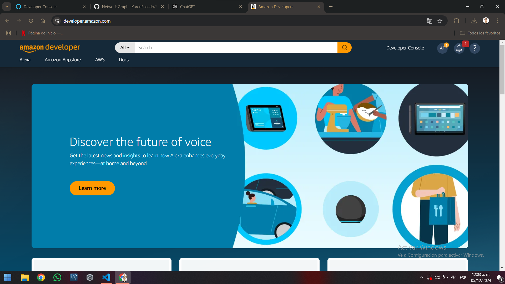

# DMI-10A-210764-SkillClima  
Creación de una skill basada en el clima para Alexa, práctica en el salón.

## DESCRIPCION:

Práctica de Clase para la Unidad 3 de la Asignatura de Desarrollo Móvil Integral (DMI) impartida  
por el M.T.I Marco A. Ramírez Hernández

## HISTORIAL DE PRÁCTICAS:  
| No. | Nombre                                                  | Firmas | Estatus |  
|-----|---------------------------------------------------------|-------------|---------|  
| 26   | Creación de skill clima                                 | 6        | Activa  |  

## LISTA DE HERRAMIENTAS  
- Amazon Developer  
- OpenWeatherMap  

## AUTOR  
Elaborado por: [Karen Alyn Fosado Rodríguez](https://github.com/KarenFosado)

| Nombre del estudiante          | Carrera                                              |  
|---------------------------------|------------------------------------------------------|  
| Karen Alyn Fosado Rodríguez     | Ingeniería en Desarrollo de Software                  |  


## OBJETIVO  
Desarrollar una **skill para Alexa** que utilice una API externa (como OpenWeatherMap) para obtener y comunicar información sobre el clima de una ciudad. Los participantes aprenderán cómo crear una skill básica para Alexa, integrando servicios web para obtener datos en tiempo real y responder a las solicitudes de los usuarios.

### Objetivos Generales:
1. **Aprender sobre el desarrollo de skills para Alexa**:  
   Los participantes aprenderán el flujo completo para crear una skill de Alexa, desde la creación en la consola de desarrolladores hasta la implementación de la lógica de la skill con AWS Lambda.

2. **Integrar servicios externos (APIs)**:  
   Se enseñará cómo interactuar con servicios externos como una API de clima para obtener datos en tiempo real y cómo procesarlos en una skill de Alexa.

3. **Desarrollar habilidades de programación en AWS Lambda**:  
   Los participantes se familiarizarán con AWS Lambda, una herramienta clave para manejar la lógica de las skills en la nube.

4. **Mejorar la comprensión de la interacción con los usuarios**:  
   A través del diseño de la skill, los participantes aprenderán cómo capturar intenciones de los usuarios y proporcionar respuestas dinámicas basadas en datos externos.

5. **Fomentar buenas prácticas de desarrollo**:  
   Los participantes aprenderán a manejar errores, estructurar la lógica de su skill de forma eficiente y garantizar que la skill sea robusta y escalable.

### Objetivos Específicos:
1. **Desarrollar habilidades en la creación de modelos de interacción**:  
   Los estudiantes aprenderán a definir las intenciones y las frases de activación que permitirán a los usuarios interactuar de forma natural con la skill.

2. **Implementar un sistema que responda con datos reales**:  
   Los participantes aprenderán cómo obtener datos en tiempo real desde una API y cómo hacer que Alexa los entregue a los usuarios de forma comprensible.

3. **Asegurar que la skill sea robusta y escalable**:  
   A lo largo de la práctica, se enfatizará la importancia de manejar posibles errores y excepciones de manera eficaz, así como la creación de una skill que se pueda ampliar fácilmente.

---

## DESCRIPCIÓN DEL PROCESO

### 1. **Crea una cuenta de desarrollador en Amazon**  
   Si aún no tengo una cuenta de desarrollador en Amazon, crearé una en [Amazon Developer Console](https://developer.amazon.com/). Luego iniciaré sesión y accederé a la consola de desarrollador.
 [alt text](README.md)


### 2. **Crea un nuevo proyecto de Alexa**  
   - En la consola de Alexa, seleccionaré "Create Skill" (Crear Skill).
   - Elegiré el idioma (por ejemplo, "Español").
   - Seleccionaré un tipo de skill "Custom" (Personalizado).
   - Asignaré un nombre a la skill (por ejemplo, "Clima Alexa").


### 3. **Configura las intenciones de la Skill**  
   - Crearé una intención llamada `Clima`.
   - Configuraré frases de activación como se muestra en imagen:  


### 4. **Verificaion de intensiones en Json**  


### 5. **Remplazamos el skillCode de lambda por el proporcionado por le docente**  


### 6. **Creamos un API para la conectividad **  


### 7. **Aplicamos las coordenadas **  


### 8. **Configuramos nombre de invocacion **  


### 9. **Personalizamos nuestro icono y lo agregamos **  


### 10. **Configuramos la privacidad y esperamos a que validen **


### 11. **Hacemos la pruebas **  
Img/Captura de pantalla 2024-12-04 233242.png

### 12. **Descargamos e iniciamos sesion con la misma cuenta para sincronizar y por ultimo verficamos en alexa movil (no tengo alexa fisica) **  


### 13. **Desarrollar la lógica de la skill usando AWS Lambda**  
   - **Configuro AWS Lambda**: Crearé una nueva función Lambda en la consola de AWS que nos impartio el profesor.
   - **Código para obtener el clima**: Utilizaré la API de OpenWeatherMap y configuraré el index para interactuar con esta API. Un ejemplo de código para mi función Lambda es el siguiente:

   ```python
  const Alexa = require('ask-sdk-core');
const axios = require('axios');

const LaunchRequestHandler = {
  canHandle(handlerInput) {
    return Alexa.getRequestType(handlerInput.requestEnvelope) === 'LaunchRequest';
  },
  handle(handlerInput) {
        const speakOutput = 'Skill de Clima de Karen Alyn Fosado 10 A, ¿Qué quieres hacer?';

    return handlerInput.responseBuilder
      .speak(speakOutput)
      .reprompt(speakOutput)
      .getResponse();
  }
};

const WeatherIntentHandler = {
  canHandle(handlerInput) {
    return (
      Alexa.getRequestType(handlerInput.requestEnvelope) === 'IntentRequest' &&
      Alexa.getIntentName(handlerInput.requestEnvelope) === 'Clima'
    );
  },
  async handle(handlerInput) {
    try {
      const apiKey = 'fc8670f58e10400bc536ed8e66c91994'; // Reemplaza con tu clave de API de OpenWeatherMap
      const lat = 20.17433; // Reemplaza con la latitud deseada
      const lon = -98.0517162; // Reemplaza con la longitud deseada

      // Llamada al endpoint de clima actual con idioma español
      const response = await axios.get(
        `https://api.openweathermap.org/data/2.5/weather?lat=${lat}&lon=${lon}&appid=${apiKey}&units=metric&lang=es`
      );

      // Datos básicos
      const temperature = response.data.main.temp;
      const weatherDescription = response.data.weather[0].description; // Ahora estará en español
      const location = response.data.name;
      const humedad = response.data.main.humidity;
      const viento = response.data.wind.speed; // Accede correctamente a la velocidad del viento

      // Temperaturas máxima y mínima
      let tem_max = response.data.main.temp_max;
      let tem_min = response.data.main.temp_min;

      if (tem_max === tem_min) {
        tem_max = tem_min = temperature; // Usa la temperatura actual como referencia
      }

      // Conversión del horario de ocaso
      const sunsetTimestamp = response.data.sys.sunset;
      const sunsetDate = new Date(sunsetTimestamp * 1000); // Convertir de Unix a ms
      const options = { timeZone: 'America/Mexico_City', hour: '2-digit', minute: '2-digit' };
      const sunsetLocalTime = new Intl.DateTimeFormat('es-MX', options).format(sunsetDate);

      // Mensaje final
      const speakOutput = `La temperatura de ${location} es de ${temperature} grados Celsius con ${weatherDescription} y viento de ${viento} km por hora. 
                           La humedad es del ${humedad}%. 
                           El sol se oculta a las ${sunsetLocalTime}. 
                           La temperatura máxima es de ${tem_max} grados y la mínima es de ${tem_min} grados.`;

      return handlerInput.responseBuilder.speak(speakOutput).getResponse();
    } catch (error) {
      console.log('Error al obtener el clima:', error);

      const speakOutput = 'Lo siento, no pude obtener la información del clima en este momento.';
      return handlerInput.responseBuilder.speak(speakOutput).getResponse();
    }
  },
};

const HelpIntentHandler = {
  canHandle(handlerInput) {
    return (
      Alexa.getRequestType(handlerInput.requestEnvelope) === 'IntentRequest' &&
      Alexa.getIntentName(handlerInput.requestEnvelope) === 'AMAZON.HelpIntent'
    );
  },
  handle(handlerInput) {
    const speakOutput = 'Puedes preguntarme sobre el clima diciendo: ¿Cuál es el clima actual?';

    return handlerInput.responseBuilder.speak(speakOutput).getResponse();
  },
};

const CancelAndStopIntentHandler = {
  canHandle(handlerInput) {
    return (
      Alexa.getRequestType(handlerInput.requestEnvelope) === 'IntentRequest' &&
      (Alexa.getIntentName(handlerInput.requestEnvelope) === 'AMAZON.CancelIntent' ||
        Alexa.getIntentName(handlerInput.requestEnvelope) === 'AMAZON.StopIntent')
    );
  },
  handle(handlerInput) {
    const speakOutput = '¡Hasta luego!';

    return handlerInput.responseBuilder.speak(speakOutput).getResponse();
  },
};

const FallbackIntentHandler = {
  canHandle(handlerInput) {
    return (
      Alexa.getRequestType(handlerInput.requestEnvelope) === 'IntentRequest' &&
      Alexa.getIntentName(handlerInput.requestEnvelope) === 'AMAZON.FallbackIntent'
    );
  },
  handle(handlerInput) {
    const speakOutput = 'Lo siento, no puedo ayudarte con eso. Por favor, inténtalo de nuevo.';

    return handlerInput.responseBuilder.speak(speakOutput).getResponse();
  },
};

const SessionEndedRequestHandler = {
  canHandle(handlerInput) {
    return Alexa.getRequestType(handlerInput.requestEnvelope) === 'SessionEndedRequest';
  },
  handle(handlerInput) {
    console.log(`Sesión terminada: ${JSON.stringify(handlerInput.requestEnvelope)}`);
    return handlerInput.responseBuilder.getResponse();
  },
};

const IntentReflectorHandler = {
  canHandle(handlerInput) {
    return Alexa.getRequestType(handlerInput.requestEnvelope) === 'IntentRequest';
  },
  handle(handlerInput) {
    const intentName = Alexa.getIntentName(handlerInput.requestEnvelope);
    const speakOutput = `Acabas de activar la intención ${intentName}.`;

    return handlerInput.responseBuilder.speak(speakOutput).getResponse();
  },
};

const ErrorHandler = {
  canHandle() {
    return true;
  },
  handle(handlerInput, error) {
    console.log(`Error manejado: ${JSON.stringify(error)}`);

    const speakOutput = 'Lo siento, hubo un problema al procesar tu solicitud. Por favor, inténtalo de nuevo.';

    return handlerInput.responseBuilder.speak(speakOutput).getResponse();
  },
};

exports.handler = Alexa.SkillBuilders.custom()
  .addRequestHandlers(
    LaunchRequestHandler,
    WeatherIntentHandler,
    HelpIntentHandler,
    CancelAndStopIntentHandler,
    FallbackIntentHandler,
    SessionEndedRequestHandler,
    IntentReflectorHandler
  )
  .addErrorHandlers(ErrorHandler)
  .lambda();
´´´